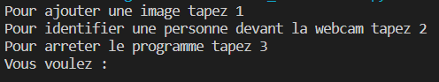
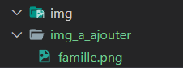
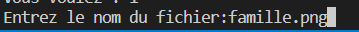
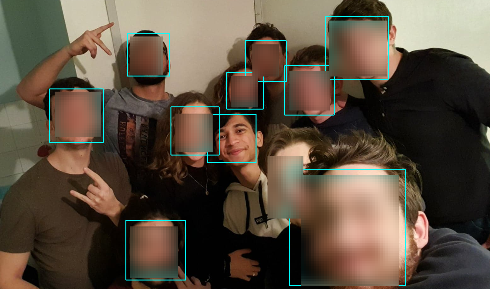
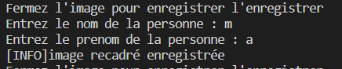
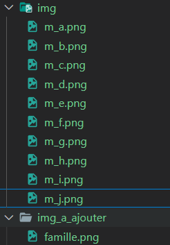

# Reconnaissance Facial
Ce repository comprend un projet personnel sur la reconnaissance facial. <br>
M'interressant au computer vision, j'ai voulu comprendre comment les systèmes de reconnaissance facial fonctionnent.<br>
Et pour cela, quoi de mieux que d'en coder un? <br>

## Table des matières
* [Présentation du projet](#présentation)
* [Installation des librairies](#installation-des-librairies)
* [Utilisation](#utilisation)

## Présentation
Ce projet est développé en python, il ne possède pas d'interface graphique ainsi toute interaction avec l'utilisateur se fait dans la console. <br>
Il possède deux fonctionnalitées: 
* detecter les visages présents sur une image, et crée une image par visage détécté
* verifier si la personne en face de la webcam est présente sur une image renseignée

## Installation des librairies
Pour installer ce projet, vous devrez tout d'abord suivre ces étapes:

* Allez sur ce site et suivre les instructions afin d'installer cmake qui est nécessaire pour l'utilisation d'une des bibliothèques
* Ensuite une fois que c'est fait, si vous avez dejà installés Python, vous pouvez executer les commandes ci dessous dans votre terminal:

```
$ pip install numpy
$ pip install opencv-python
$ pip install cmake
$ pip install dlib
$ pip install imutils

```
Une fois que ceci est fait, vous pouvez lancer le projet.

## Utilisation
Veuillez run le fichier main.py.
Lors du lancement du programme, vous pourrez soit enregistrer les visages sur une nouvelle image, soit identifier une personne devant la webcam  <br> <br>
 <br> <br> <br>

### Enregistrer les visages présents sur une image <br> <br> 
Placez l'image à analyser dans le dossier img_a_ajouter.  <br> <br>
  <br> <br> <br>
Puis lorsque le programme ce lance, tapez 1.  <br><br>

Rentrez le nom de l'image placée dans le dossier avec l'extension du fichier (.png ou .jpeg). <br> <br>

 <br> <br><br>

Une fois que cela est fait l'image que vous aurez tapés s'ouvrira dans une fenêtre:  <br><br>

  <br><br>
(J'ai volontairement flouté les visages qui ne sont pas le mien) <br> <br>

Puis lorsque vous l'aurez fermée, une deuxième s'ouvrira avec les visages détectés encadrés en bleu:  <br> <br>

  <br> <br> <br>

Ensuite une image s'ouvrira avec le premier visage détecté:  <br><br>
  <br> <br> <br>

Une fois que vous aurez fermés la fenêtre, vous devrez entrer le nom et le prenom de la personne:  <br> <br>
  <br> <br> <br>

Une fois cela fait, la même chose vous sera demandée pour chaque visage. <br> <br>

Chaque image sera enregistrée dans le dossier 'img', avec pour nom de fichier nom_prenom.png:  <br> <br> 
 <br>
 


