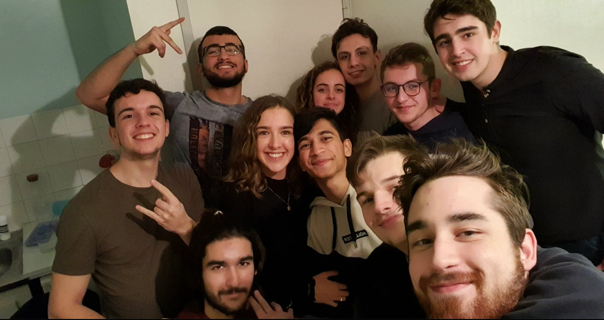

# Reconnaissance Facial
Ce repository comprend un projet personnel sur la reconnaissance facial. <br>
M'interressant au computer vision, j'ai voulu comprendre comment les systèmes de reconnaissance facial fonctionnent.<br>
Et pour cela, quoi de mieux que d'en coder un? <br>

## Table des matières
* [Présentation du projet](#presentation-du-projet)
* [Installation des librairies](#installation-des-librairies)
* [Utilisation](#utilisation)

## Présentation
Ce projet est développé en python, il ne possède pas d'interface graphique ainsi toute interaction avec l'utilisateur se fait dans la console. <br>
Il possède deux fonctionnalitées: 
* detecter les visages présents sur une image, et crée une image par visage détécté
* verifier si la personne en face de la webcam est présente sur une image renseignée

## Installation des librairies
Pour installer ce projet, vous devrez tout d'abord suivre ces étapes:

* Allez sur ce site et suivre les instructions afin d'installer cmake qui est nécessaire pour l'utilisation d'une des bibliothèques
* Ensuite une fois que c'est fait, si vous avez dejà installés Python, vous pouvez executer les commandes ci dessous dans votre terminal:

```
$ pip install numpy
$ pip install opencv-python
$ pip install cmake
$ pip install dlib
$ pip install imutils

```
Une fois que ceci est fait, vous pouvez lancer le projet.

## Utilisation



 


